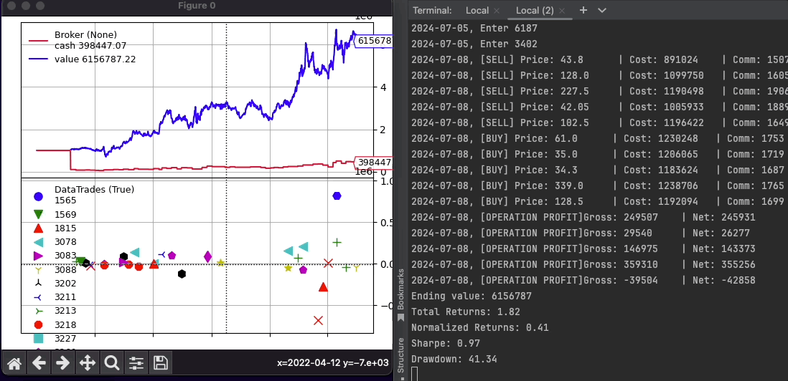

# ai-trader

[](https://www.python.org/downloads/)
[](LICENSE)

[中文版說明 (Chinese Subpage)](README_zh.md)

A comprehensive backtesting framework for algorithmic trading strategies built on Backtrader. Test and optimize your trading strategies across US stocks, Taiwan stocks, and cryptocurrencies.

**Version 0.2.0** introduces a new architecture with utility functions, CLI tools, and config-driven workflows for professional backtesting.



## ✨ What's New in v0.2.0

- **New CLI Tool** - Run backtests from YAML configs
- **Utility Functions** - Simple helpers for common tasks
- **Config-Driven** - Version-controlled, reproducible backtests
- **20+ Strategies** - Ready-to-use trading strategies
- **Multi-Market** - US stocks, TW stocks, and crypto support
- **Rich Examples** - 5 example scripts and 4 config templates

## Strategy overview 
### Single stock trading 
- SMA (Niave SMA & Cross SMA)
- Bollinger Band
- Momentum 
- RSI
- Resistance Support Relative Strength (RSRS)
- ROC
- Double Top
- Risk Averse
- Turtle
- Volatility Contraction Pattern (VCP)

### Portfolio trading
- ROC rotation
- RSRS rotation
- Triple RSI rotation
- Multi Bollinger Bands rotation

### Machine learning based (dev)
- Logistic regression
- Feature engineering
- Gradient boosting
- DNN
- RNN
- LSTM
- Reinforcemnt learning
- (More to come!)

## Quick Start

### Installation

1. **Clone the repository:**
    ```bash
    git clone https://github.com/whchien/ai-trader.git
    cd ai-trader
    ```

2. **Install dependencies:**
    ```bash
    pip install -r requirements.txt
    ```

3. **Install the package** (optional, for CLI access):
    ```bash
    pip install -e .
    ```

### Run Your First Backtest

**Option 1: Using Python (Quick)**
```python
from ai_trader import run_backtest
from ai_trader.backtesting.strategies.classic.sma import SMAStrategy

# Run backtest with example data
results = run_backtest(
    strategy=SMAStrategy,
    data_source=None,  # Uses built-in example data
    cash=1000000,
    commission=0.001425,
    strategy_params={"fast_period": 10, "slow_period": 30}
)
```

**Option 2: Using CLI (Recommended for Production)**
```bash
# Run backtest from config file
ai-trader run config/backtest/sma_example.yaml

# Quick backtest without config
ai-trader quick SMAStrategy data/AAPL.csv --cash 100000

# List available strategies
ai-trader list-strategies
```

**Option 3: Step-by-Step Control**
```python
from ai_trader.utils.backtest import (
    create_cerebro, add_stock_data, add_sizer,
    add_default_analyzers, print_results
)
from ai_trader.backtesting.strategies.classic.bbands import BBandsStrategy

# 1. Create cerebro
cerebro = create_cerebro(cash=500000, commission=0.001)

# 2. Add data
add_stock_data(cerebro, source="data/AAPL.csv")

# 3. Add strategy
cerebro.addstrategy(BBandsStrategy, period=20, devfactor=2.0)

# 4. Configure
add_sizer(cerebro, "percent", percents=90)
add_default_analyzers(cerebro)

# 5. Run
initial_value = cerebro.broker.getvalue()
results = cerebro.run()
final_value = cerebro.broker.getvalue()

# 6. View results
print_results(results, initial_value, final_value)
```

### Download Market Data

```bash
# US stocks
ai-trader fetch AAPL --market us --start-date 2020-01-01

# Taiwan stocks
ai-trader fetch 2330 --market tw --start-date 2020-01-01

# Cryptocurrency
ai-trader fetch BTC-USD --market crypto --start-date 2020-01-01
```

## CLI Reference

### Available Commands

```bash
# Run backtest from config
ai-trader run <config.yaml> [--strategy <name>] [--cash <amount>] [--commission <rate>]

# Quick backtest without config
ai-trader quick <StrategyName> <data_file> [options]

# List available strategies
ai-trader list-strategies [--type classic|portfolio|all]

# Fetch market data
ai-trader fetch <symbol> --market <us|tw|crypto> [--start-date YYYY-MM-DD] [--end-date YYYY-MM-DD]

# Show help
ai-trader --help
```

### Config File Structure

Create a YAML config file (e.g., `my_strategy.yaml`):

```yaml
broker:
  cash: 1000000
  commission: 0.001425

data:
  file: "data/AAPL.csv"  # Single stock
  # OR
  # directory: "./data/tw_stock/"  # Portfolio
  start_date: "2020-01-01"
  end_date: "2023-12-31"

strategy:
  class: "SMAStrategy"
  params:
    fast_period: 10
    slow_period: 30

sizer:
  type: "percent"  # or "fixed"
  params:
    percents: 95

analyzers:
  - sharpe
  - drawdown
  - returns
  - trades
```

**See `config/backtest/` for complete examples.**

## Creating Custom Strategies

### Method 1: Simple Strategy File

Create a new Python file in `ai_trader/backtesting/strategies/classic/`:

```python
import backtrader as bt
from ai_trader.backtesting.strategies.base import BaseStrategy

class MyCustomStrategy(BaseStrategy):
    """My custom trading strategy."""

    params = dict(
        period=20,
        threshold=0.02,
    )

    def __init__(self):
        # Initialize indicators
        self.sma = bt.indicators.SMA(self.data.close, period=self.params.period)

    def next(self):
        # Trading logic
        if not self.position:
            # Entry condition
            if self.data.close[0] > self.sma[0] * (1 + self.params.threshold):
                self.buy()
        else:
            # Exit condition
            if self.data.close[0] < self.sma[0]:
                self.close()

# Optional: Test the strategy
if __name__ == "__main__":
    from ai_trader.utils.backtest import run_backtest

    results = run_backtest(
        strategy=MyCustomStrategy,
        data_source=None,  # Use example data
        strategy_params={"period": 20, "threshold": 0.02}
    )
```

### Method 2: Inline Strategy (Quick Testing)

```python
import backtrader as bt
from ai_trader.utils.backtest import create_cerebro, add_stock_data, print_results

class QuickTestStrategy(bt.Strategy):
    def next(self):
        if not self.position and self.data.close[0] > self.data.close[-1]:
            self.buy()
        elif self.position and self.data.close[0] < self.data.close[-1]:
            self.sell()

cerebro = create_cerebro(cash=100000)
add_stock_data(cerebro, source="data/AAPL.csv")
cerebro.addstrategy(QuickTestStrategy)

initial = cerebro.broker.getvalue()
results = cerebro.run()
final = cerebro.broker.getvalue()
print_results(results, initial, final)
```

### Strategy Development Tips

1. **Inherit from `BaseStrategy`** for common functionality
2. **Define parameters** using `params = dict(...)`
3. **Initialize indicators** in `__init__()`
4. **Implement logic** in `next()` method
5. **Test thoroughly** with different market conditions
6. **Use logging** instead of print statements
7. **Add docstrings** to explain strategy logic

## Project Structure

```
ai-trader/
├── ai_trader/                  # Main package
│   ├── backtesting/           # Backtesting components
│   │   └── strategies/        # Trading strategies
│   │       ├── classic/       # Single-stock strategies (13)
│   │       └── portfolio/     # Multi-stock strategies (3)
│   ├── core/                  # Core utilities
│   │   ├── config.py          # Configuration management
│   │   ├── exceptions.py      # Custom exceptions
│   │   ├── logging.py         # Logging setup
│   │   └── utils.py           # Helper functions
│   ├── data/                  # Data layer
│   │   └── fetchers/          # Data fetchers
│   │       ├── base.py        # US/TW stock fetcher
│   │       └── crypto.py      # Crypto fetcher
│   ├── utils/                 # Utility functions
│   │   └── backtest.py        # Backtest helpers
│   ├── cli.py                 # CLI tool
│   └── trader.py              # Legacy AITrader (deprecated)
├── config/                    # Configuration files
│   └── backtest/              # Backtest configs
│       ├── sma_example.yaml
│       ├── bbands_example.yaml
│       ├── portfolio_example.yaml
│       └── crypto_example.yaml
├── scripts/                   # Helper scripts
│   └── examples/              # Example scripts
│       ├── 01_simple_backtest.py
│       ├── 02_step_by_step.py
│       ├── 03_portfolio_backtest.py
│       ├── 04_pure_backtrader.py
│       └── 05_compare_strategies.py
├── docs/                      # Documentation
│   ├── MIGRATION_GUIDE.md     # Migration from v0.1.x
│   └── REFACTORING_SUMMARY.md # v0.2.0 changes
├── tests/                     # Test suite
│   ├── unit/                  # Unit tests
│   └── integration/           # Integration tests
└── data/                      # Data directory (created on first use)
```

## Documentation & Resources

- **[Migration Guide](docs/MIGRATION_GUIDE.md)** - Upgrading from v0.1.x to v0.2.0
- **[Example Scripts](scripts/examples/)** - 5 complete working examples
- **[Config Examples](config/backtest/)** - YAML configuration templates
- **[Refactoring Summary](docs/REFACTORING_SUMMARY.md)** - Technical details of v0.2.0

### Example Scripts

1. **01_simple_backtest.py** - Quick start with `run_backtest()`
2. **02_step_by_step.py** - Detailed step-by-step example
3. **03_portfolio_backtest.py** - Multi-stock portfolio strategy
4. **04_pure_backtrader.py** - Pure Backtrader without utilities
5. **05_compare_strategies.py** - Compare multiple strategies

Run any example:
```bash
python scripts/examples/01_simple_backtest.py
```

## 🔧 Advanced Usage

### Compare Multiple Strategies

```python
from ai_trader import run_backtest
from ai_trader.backtesting.strategies.classic.sma import SMAStrategy
from ai_trader.backtesting.strategies.classic.rsi import RSIStrategy

strategies = [
    (SMAStrategy, {"fast_period": 10, "slow_period": 30}),
    (RSIStrategy, {"rsi_period": 14, "oversold": 30})
]

for strategy, params in strategies:
    print(f"\nTesting {strategy.__name__}...")
    results = run_backtest(
        strategy=strategy,
        strategy_params=params,
        print_output=True
    )
```

### Custom Data Source

```python
import pandas as pd
from ai_trader.utils.backtest import create_cerebro, add_stock_data

# Load your custom data
df = pd.read_csv("my_data.csv", parse_dates=["Date"], index_col=["Date"])
# Must have columns: Open, High, Low, Close, Volume

cerebro = create_cerebro()
add_stock_data(cerebro, source=df, name="CUSTOM")
# ... continue with strategy setup
```

### Portfolio Optimization

```python
from ai_trader.utils.backtest import create_cerebro, add_portfolio_data
from ai_trader.backtesting.strategies.portfolio.roc_rotation import ROCRotationStrategy

cerebro = create_cerebro(cash=2000000)
add_portfolio_data(cerebro, data_dir="./data/tw_stock/")

# Test different parameters
for k in [3, 5, 7]:
    for days in [20, 30, 40]:
        cerebro.addstrategy(ROCRotationStrategy, k=k, rebalance_days=days)
        # ... run and analyze
```

## Contributing

Contributions are welcome! Please feel free to:

- Report bugs and issues
- Suggest new features or strategies
- Submit pull requests
- Improve documentation
- Share your backtesting results

## License

This project is licensed under the MIT License - see the LICENSE file for details.

## Show Your Support

If you find this project helpful, please give it a star ⭐️! Your support motivates continued development and improvements.

## Contact

- **Author**: Will Chien
- **GitHub**: [@whchien](https://github.com/whchien)

## Acknowledgments

- Built on top of the excellent [Backtrader](https://www.backtrader.com/) framework
- Inspired by the quantitative trading community
- Thanks to all contributors and users

---

**Note for v0.1.x users**: The `AITrader` class is deprecated in v0.2.0. Please see the [Migration Guide](docs/MIGRATION_GUIDE.md) for upgrade instructions. Your existing code will continue to work but will emit deprecation warnings. 