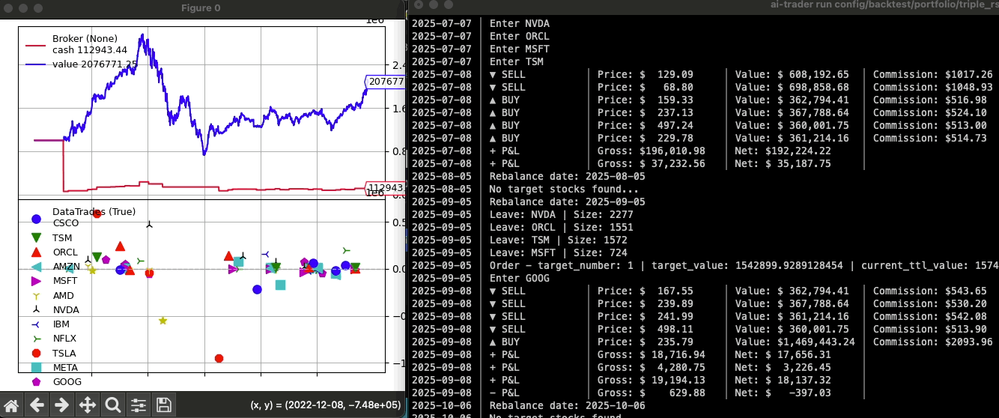

# AI-Trader

[](https://www.python.org/downloads/)
[](LICENSE)

[English Version (英文版)](README.md)

一個專業、設定檔驅動的演算法交易回測框架，建立在 Backtrader 之上。無縫在股票、加密貨幣和外匯市場中測試、優化並整合交易策略與大型語言模型 (LLM)。



## 主要功能

- **設定檔驅動工作流程**：使用可版本控制的 YAML 檔案來定義和管理回測，以獲得可重現的結果。
- **無縫的 LLM 整合**：內建的 MCP (模型內容協定) 伺服器允許像 Claude 這樣的 AI 助理運行回測、擷取資料和分析策略。
- **支援多市場**：在美股、台股、加密貨幣和外匯上測試策略。
- **豐富的策略庫**：附帶超過 20 種內建策略，從經典指標到先進的自適應模型。
- **強大的 CLI 工具**：一個豐富的命令列介面，用於運行回測、擷取市場資料和列出策略。
- **開發者友善**：透過簡單的輔助工具和清晰的結構，輕鬆建立和測試自訂策略。

## 快速入門

**1. 安裝**

**選項 A：從 PyPI 安裝（推薦）**
```bash
pip install ai-trader
```

**選項 B：從原始程式碼安裝**
```bash
git clone https://github.com/whchien/ai-trader.git
cd ai-trader
pip install -e .
```
*(Poetry 使用者可執行 `poetry install`)*

**2. 透過 CLI 執行回測 (建議)**

使用設定檔執行預定義的回測：
```bash
# 從設定檔執行回測
ai-trader run config/backtest/classic/sma_example.yaml
```

或者，對特定的資料檔案執行快速回測：
```bash
# 不需設定檔的快速回測
ai-trader quick CrossSMAStrategy data/us_stock/tsm.csv --cash 100000
```

**3. 擷取市場資料**

為任何支援的市場下載歷史資料：
```bash
# 美國股市
ai-trader fetch AAPL --market us_stock --start-date 2020-01-01

# 加密貨幣
ai-trader fetch BTC-USD --market crypto --start-date 2020-01-01
```

## 核心工作流程

### 1. 基於設定檔的回測

最穩健的運行回測方式是使用 YAML 設定檔。

**`my_backtest.yaml`:**
```yaml
broker:
  cash: 1000000
  commission: 0.001425

data:
  file: "data/us_stock/TSM.csv"
  start_date: "2020-01-01"
  end_date: "2023-12-31"

strategy:
  class: "CrossSMAStrategy"
  params:
    fast: 10
    slow: 30

sizer:
  type: "percent"
  params:
    percents: 95
```
**執行它：**
```bash
ai-trader run my_backtest.yaml
```
更多範例請參見 `config/backtest/`。

### 2. 基於 Python 的回測

用於更精細的控制或整合到其他 Python 指令稿中。

**簡單方法：**
```python
from ai_trader import run_backtest
from ai_trader.backtesting.strategies.classic.sma import CrossSMAStrategy

# 使用範例資料執行回測
results = run_backtest(
    strategy=CrossSMAStrategy,
    data_source=None,  # 使用內建的範例資料
    cash=1000000,
    strategy_params={"fast": 10, "slow": 30}
)
```

**逐步控制：**
詳細範例請參見 `scripts/examples/02_step_by_step.py`。

### 3. LLM 整合 (MCP 伺服器)

將 `ai-trader` 作為伺服器運行，讓 AI 助理與您的回測引擎互動。

**啟動伺服器：**
```bash
python -m ai_trader.mcp
```

啟動後，您可以設定像 Claude Desktop 這樣的代理程式來連接它。這使得能夠使用自然語言命令，例如：
- *"對 TSM 從 2020 年到 2022 年的資料運行 CrossSMAStrategy 的回測。"*
- *"列出所有可用的交易策略。"*
- *"擷取從 2021 年到 2024 年的蘋果股票資料。"*

## 建立自訂策略

在 `ai_trader/backtesting/strategies/classic/` 中建立一個新檔案，並繼承 `BaseStrategy`。

```python
# ai_trader/backtesting/strategies/classic/my_strategy.py
import backtrader as bt
from ai_trader.backtesting.strategies.base import BaseStrategy

class MyCustomStrategy(BaseStrategy):
    params = dict(period=20)

    def __init__(self):
        self.sma = bt.indicators.SMA(self.data.close, period=self.p.period)

    def next(self):
        if not self.position and self.data.close[0] > self.sma[0]:
            self.buy()
        elif self.position and self.data.close[0] < self.sma[0]:
            self.close()
```
新策略會自動在 CLI 和 `run_backtest` 函式中可用。

## 文件與資源

- **[策略範例](ai_trader/backtesting/strategies/README.md)**：關於內建策略的詳細資訊。
- **[範例指令稿](scripts/examples/)**：5 個針對不同使用案例的完整工作範例。
- **[設定檔模板](config/backtest/)**：YAML 設定檔模板。
- **[遷移指南](docs/MIGRATION_GUIDE.md)**：用於從 v0.1.x 版本升級。

## 貢獻

歡迎貢獻！隨時回報錯誤、建議功能或提交 PR。

## 支持我們

如果您覺得這個專案有幫助，請給它一顆星！

## 授權

本專案採用 GNU 通用公共授權第 3 版 (GPL-3.0)。詳情請參見 [LICENSE](LICENSE) 檔案。